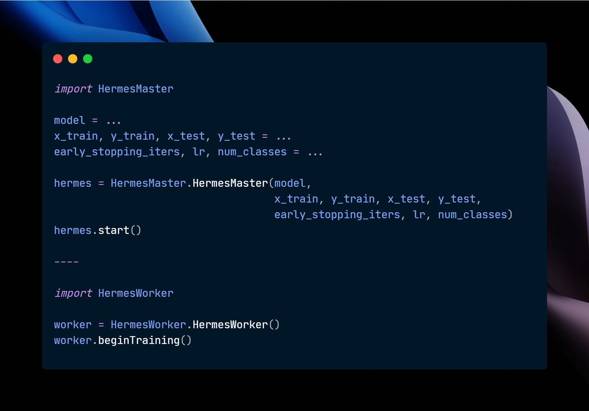

# Hermes
[](http://hits.dwyl.com/DaSH-Lab-CSIS/Hermes)
[](https://www.gnu.org/licenses/gpl-3.0)

This repo is an official implementation of **Hermes** for the paper *When Less is More: Achieving Faster Convergence in Distributed Edge Machine Learning* (accepted at 31st IEEE HiPC. best paper nominee ✨).

Distributed Machine Learning (DML) on resource-constrained edge devices holds immense potential for real-world applications. However, achieving fast convergence in DML in these heterogeneous environments remains a significant challenge. Traditional frameworks like Bulk Synchronous Parallel (BSP) and Asynchronous Stochastic Parallel (ASP) rely on frequent, small updates that incur substantial communication overhead and hinder convergence speed. Furthermore, these frameworks often employ static dataset sizes, neglecting the heterogeneity of edge devices and potentially leading to straggler nodes that slow down the entire training process. The straggler nodes, i.e., edge devices that take significantly longer to process their assigned data chunk – hinder the overall training speed. To address these limitations, this paper proposes Hermes, a novel probabilistic framework for efficient DML on edge devices. This framework leverages a dynamic threshold based on recent test loss behavior to identify statistically significant improvements in the model's generalization capability, hence transmitting updates only when major improvements are detected, thereby significantly reducing communication overhead. Additionally, Hermes employs dynamic dataset allocation to optimize resource utilization and prevents performance degradation caused by straggler nodes. Our evaluations on a real-world heterogeneous resource-constrained environment demonstrate that Hermes achieves faster convergence compared to state-of-the-art methods, resulting in a remarkable 13.22x reduction in training time and a 62.1% decrease in communication overhead.

## 0. Installation
- You will require a parameter server (PS) and X number of worker nodes. To connect your workers and PS to a private network (unless otherwise connected on LAN or a central network), we recommend using Tailscale (https://tailscale.com/) for doing so. Tailscale allows 100 devices to be simulaneously connected to a local network. All nodes should contactable via SSH.
- Clone this repository to your PS.
- Modify the configuration files in `./conf/`. This folder contains `config.json, master.json, settings.json`. Add the required IPs, hostnames and passwords of the worker and the PS. You would also need to add your PS' IP in the `dependencies_master.sh` (line 38).
- Once modified, you may transfer files to workers via `scp`. 

### 0a. Installation on the PS
- Install all the required dependencies on the PS via the following command. Ensure you change line 38 to your PS' IP on the private network.
```bash
./dependencies_master.sh
```
- If not, you may also pull this Docker image with all dependencies set up to run Hermes: `floofcat/hermes:master`

### 0b. Installation on Workers
- You may install all the required dependencies on each worker via the following command.
```bash
./dependencies_master.sh
```
- If not, you may also pull this Docker image with all dependencies set up to run Hermes: `floofcat/hermes:master`

## 1. Execution
The novelty of Hermes is we allow users to utilize their own models and datasets for training the same via DML. However, at the current moment, we only support TensorFlow models, but we are actively working to extend support to Pytorch. You may define your own custom model and dataset in `./examples/master.py`. You need not modify `./examples/worker.py`.

An example has been provided in the comments of `./examples/master.py`. Once modified, run the following commands on your respective devices.

### 1a. Execution on PS
Hermes can be executed on the PS using the following commands. You would need to initialize the Kafka broker and execute the script you modified.
```bash
tmux new-session -d -s kafkaone "cd ./kafka_2.13-3.8.0/ && bin/zookeeper-server-start.sh config/zookeeper.properties"
tmux new-session -d -s kafkatwo "cd ./kafka_2.13-3.8.0/ && bin/kafka-server-start.sh config/server.properties"
sleep 10
tmux new-session -d -s master "cd ./examples/ && python3 master.py"
```

You can review the logs of execution during training. 
```bash
tail -f ./Hermes/data/centralized-logs/distml-central.txt
```

### 1b. Execution on Workers
To begin execution on workers, you will need to wait until the logs on the PS state the following: 
> "Master has been successfully initialized!" 

Execution can be done using the following command.
```bash
tmux new-session -d -s worker "cd ./examples/ && python3 worker.py"
```

### 1c. Begin training on PS
Once the master and workers have been initialized, you will need to input 'y' to the master twice to send the model to the workers as well as the first dataset batch. 

## 2. License
Our source code is under the GNU General Public License v3.0.

## 3. Authors
Authors: [Advik Raj Basani](https://github.com/FloofCat), [Siddharth Vivek](https://github.com/S1ddh4rth), [Advaith Krishna](https://github.com/Advaith04), [Arnab K. Paul](https://github.com/arnabkrpaul)

Other contributors: [Palash Gupta](https://github.com/palash-gupta), [Imaad Momin](https://github.com/ImaadM097), [Kunal Mishra](https://github.com/kunalm2345).

The authors are thankful to all contributors for their work to this framework.

## 4. Citation
If you use Hermes in your research, please cite our paper:
```
@misc{basani2024moreachievingfasterconvergence,
      title={When Less is More: Achieving Faster Convergence in Distributed Edge Machine Learning}, 
      author={Advik Raj Basani and Siddharth Chaitra Vivek and Advaith Krishna and Arnab K. Paul},
      year={2024},
      eprint={2410.20495},
      archivePrefix={arXiv},
      primaryClass={cs.DC},
      url={https://arxiv.org/abs/2410.20495}, 
}
```

## 5. Future Work
- Extend this framework to Pytorch.
- Implementation of abelation studies on Hermes.


